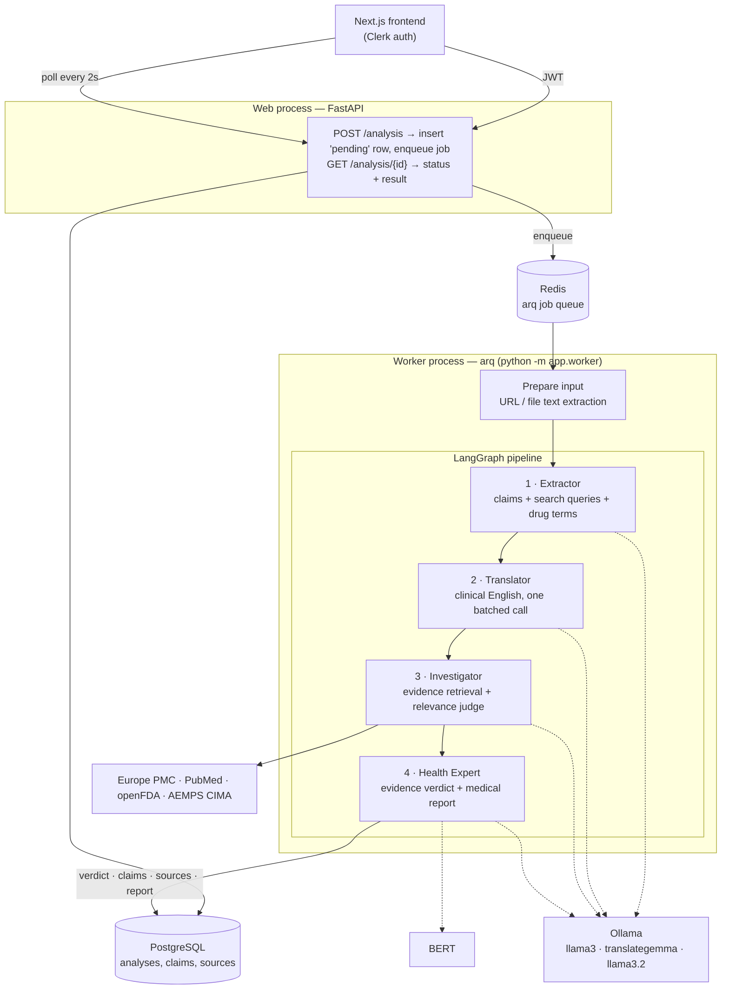

# VeriTrust

[](https://github.com/ldelvillar/veritrust/actions/workflows/ci.yml)
[](LICENSE)

**AI-powered medical misinformation detection.** Users submit a piece of health-related content — pasted text, a URL, or a document (PDF/TXT/MD) — and VeriTrust returns an evidence-grounded verdict: **Verdadero** (true), **Falso** (false), or **Dudoso** (uncertain), with a confidence score, a per-claim breakdown, the biomedical sources consulted, and a medical report explaining the verdict in plain Spanish.

Health misinformation spreads faster than experts can debunk it. VeriTrust automates the first pass of that debunking: it extracts the verifiable medical claims from a text, cross-checks each one against real biomedical literature (Europe PMC, PubMed, openFDA, AEMPS CIMA), derives a verdict from the stance of that literature, and writes up the result — with the honesty to say *"Dudoso"* and lower its confidence when the literature is thin, contradictory, or silent.

## How it works

Analysis is asynchronous: the pipeline chains several LLM calls, literature lookups, and BERT inference, so it runs in a background worker instead of the HTTP request. `POST /analysis` returns a `pending` id immediately; an [arq](https://arq-docs.helpmanual.io/) worker picks the job off Redis, runs the LangGraph pipeline, and the frontend polls `GET /analysis/{id}` every 2 s (showing the live pipeline stage) until the verdict is ready.



### The four agents

| Agent | Model | What it does |
| --- | --- | --- |
| **Extractor** | `llama3`¹ | Extracts the verifiable medical claims from the input text, plus an English boolean search query and the drug name (if any) for each claim. Structured output. |
| **Translator** | `translategemma` | Translates all claims to clinical English in a single batched call — the literature sources work in English. |
| **Investigator** | `llama3.2` (judge) | Queries Europe PMC, PubMed, and openFDA for every claim in parallel — plus AEMPS CIMA when the claim names a drug. An LLM judge filters the hits for relevance and tags each source's stance (*supports* / *contradicts*). Computes **evidence coverage**: the share of claims with relevant literature. |
| **Health Expert** | `llama3.2` | Derives each claim's fake probability from the stance of the retrieved literature (Laplace-smoothed, so thin evidence never reaches certainty), and averages them into a three-way verdict — a band around the decision threshold maps to *uncertain*, and a claim no source speaks to is *uncertain* by construction, never *false*. Then it writes the medical report with `llama3.2`, grounded in the retrieved sources. |

¹ In the Docker stack the Extractor runs on `llama3.2` (set in `docker-compose.yml`) so the whole pipeline fits one small model plus the translator.

Two guardrails temper the raw verdict (`app/core/credibility.py`):

- **Evidence attenuation** — confidence is scaled down when little of the input is covered by actual literature, so the system never sounds sure about claims nobody has studied.
- **Opposition softening** — when the retrieved literature's stance contradicts the classifier's verdict, the verdict is softened toward *Dudoso* (never inverted silently).

### Product surface

- **Analysis** of pasted text, URLs (SSRF-hardened fetching), and uploaded PDF/TXT/MD files (≤ 10 MB), with per-stage progress while pending and retry for failed runs.
- **Per-claim breakdown** — each extracted claim gets its own verdict and confidence, alongside the sources that support or contradict it.
- **History** with search, pagination, and CSV export (formula-injection safe).
- **Dashboard** with aggregate metrics over your analyses.
- **Public share links** — a read-only `/r/{token}` page per analysis, revocable.
- **Auth & limits** — Clerk JWT on every API route, per-user rate limiting on submission.

## Stack

- **Backend** — FastAPI + [arq](https://arq-docs.helpmanual.io/) worker (Python 3.11), LangGraph, LangChain + Ollama, Transformers (BioBERT), raw async SQL via psycopg3 (no ORM)
- **Frontend** — Next.js 16 (App Router), React 19, Clerk, SWR, Tailwind CSS v4
- **Data** — PostgreSQL 16, Redis 7 (job queue)
- **ML** — evaluation pipeline in `backend/ml/`, scored against HealthVer and a hand-written Spanish gold set; see `docs/ml-experiments.md`
- **Ops** — Docker Compose with healthchecks + autoheal, Caddy TLS reverse proxy, GitHub Actions CI/CD deploying to a GCP VM

## Repository layout

```text
backend/
  app/            FastAPI service: routes, agents, db, schemas, prompts
  ml/             Training + evaluation experiments (separate test suite)
  data/           HealthVer splits + gold_es.jsonl hand-written gold set (committed)
  models/         Legacy BioBERT weights (gitignored; no longer used at serving time)
  db/init.sql     Database schema (applied to a fresh Postgres)
frontend/
  src/            Next.js App Router app
docs/             Production runbooks (secrets, backups, monitoring, ops)
docker-compose.yml           Local/full stack
docker-compose.prod.yml      Production overlay: Caddy TLS + memory caps
```

## Running it

### Prerequisites

- Docker (for the compose stack) — or, for running processes natively: Python 3.11+ with [`uv`](https://docs.astral.sh/uv/), Node.js 22+ with `pnpm` 11 (`corepack enable`), an [Ollama](https://ollama.com/) install, PostgreSQL, and Redis
- A free [Clerk](https://clerk.com/) application (authentication) — copy its JWKS URL, issuer, audience, secret key, and publishable key into `.env`

### BioBERT model (legacy)

The serving pipeline no longer uses a classifier — the verdict comes from the retrieved literature (see `docs/ml-experiments.md`). The training and evaluation scripts are kept so the experiments in that log stay reproducible. `backend/models/` is not in git; to re-run them, train a checkpoint (CPU works; a GPU is much faster):

```bash
uv sync --directory backend --frozen --extra ml
uv run --directory backend python -m ml.training.train
```

Training writes a versioned subdirectory (`bert_classifier/<timestamp>-<git-sha>/`) with a `metadata.json` recording the git SHA, dataset sizes, and test metrics. Inference auto-selects the latest version; pin one by setting `FAKE_NEWS_MODEL_PATH`.

### Quick start — Docker

```bash
cp .env.example .env    # set POSTGRES_PASSWORD, REDIS_PASSWORD, and the Clerk values
docker compose up -d --build
docker compose exec ollama ollama pull llama3.2
docker compose exec ollama ollama pull translategemma
```

Frontend at `http://localhost:3000`, API at `http://localhost:8000` (health at `/healthz`). The compose stack wires everything: Postgres (schema auto-applied from `backend/db/init.sql`), Redis, Ollama, the API, the worker (BioBERT weights mounted read-only), the frontend, and an autoheal sidecar that restarts any container whose healthcheck fails.

### Local development (processes on your machine)

```bash
cp backend/.env.example backend/.env      # fill in DATABASE_URL, REDIS_URL, Clerk values
cp frontend/.env.example frontend/.env    # fill in NEXT_PUBLIC_API_URL + Clerk keys

ollama pull llama3 && ollama pull llama3.2 && ollama pull translategemma

uv sync --directory backend --frozen
uv run --directory backend python -m app.main      # API → http://localhost:8000
uv run --directory backend python -m app.worker    # worker (separate terminal)

pnpm --dir frontend install
pnpm --dir frontend dev                            # → http://localhost:3000
```

Required backend env: `DATABASE_URL`, `CLERK_JWKS_URL`, `CLERK_AUDIENCE` (and `CORS_ALLOWED_ORIGINS` outside `ENVIRONMENT=development`). Missing config surfaces at startup and as a `/healthz` 503, not as per-request 500s. See `backend/.env.example` for every knob (Ollama models/timeouts, evidence-source URLs, queue tuning, rate limits).

### Production (GCP VM + Caddy TLS)

The production deployment is the same compose stack on a single GCP Compute Engine VM, behind a Caddy reverse proxy that terminates TLS (automatic Let's Encrypt) for two subdomains — `app.<domain>` (frontend) and `api.<domain>` (backend). The overlay unpublishes every port except Caddy's 80/443 and adds per-container memory caps.

```bash
docker compose -f docker-compose.yml -f docker-compose.prod.yml up -d --build
```

Requires DNS `A` records for both subdomains, inbound 80/443, and `APP_DOMAIN`/`API_DOMAIN`/`ACME_EMAIL` in `.env`. `NEXT_PUBLIC_API_URL` is baked into the frontend at **build** time, so a domain change needs `--build`, not just a restart. Add `https://app.<domain>` as an allowed origin in Clerk.

**CI/CD**: every push to `main` runs CI (`.github/workflows/ci.yml`); on success, `.github/workflows/deploy.yml` SSHes into the VM, renders the production `.env` from GCP Secret Manager, and redeploys the stack. Operational runbooks live in [docs/](docs/):

- [deploy-secrets.md](docs/deploy-secrets.md) — production `.env` in Secret Manager (source of truth)
- [deploy-env.md](docs/deploy-env.md) — env bootstrap before the secret exists
- [deploy-backups.md](docs/deploy-backups.md) — automated `pg_dump` backups
- [deploy-monitoring.md](docs/deploy-monitoring.md) — uptime checks + alerting
- [deploy-ops.md](docs/deploy-ops.md) — hardening, log rotation, day-2 operations

## Development

All commands run from the repo root. CI enforces every gate below.

```bash
# Backend
uv run --directory backend pytest tests --cov=app --cov-fail-under=80    # app tests
uv run --directory backend pytest ml/tests --cov=ml --cov-fail-under=80  # ML tests (needs --extra ml)
uv run --directory backend ruff check app ml tests                       # lint
uv run --directory backend ruff format app ml tests                      # format
uv run --directory backend mypy                                          # type-check

# Frontend
pnpm --dir frontend lint
pnpm --dir frontend test                # vitest
pnpm --dir frontend build               # production build (also type-checks)
```

- **Typed API contract** — `frontend/src/types/api.d.ts` is generated from the backend's OpenAPI spec. After any backend schema change run `pnpm --dir frontend generate:api-types` (backend running); never edit it by hand.
- **Database schema** — `backend/db/init.sql`, applied once to a fresh database. No migration framework yet: recreate the volume (`docker compose down -v && docker compose up`) to pick up schema changes.
- **Prompts** — all agent system prompts live in `backend/app/prompts/prompts.yaml`, never inline in Python.
- **ML evaluation** — `ml/evaluation/evaluate_pipeline.py` runs the full four-agent pipeline against labeled HealthVer samples (or `--partition gold`) and reports classification metrics; `ml/evaluation/evaluate_factcheck.py` compares against Google's Fact Check API (needs `GOOGLE_API_KEY`).

## License

MIT — see [LICENSE](LICENSE).
